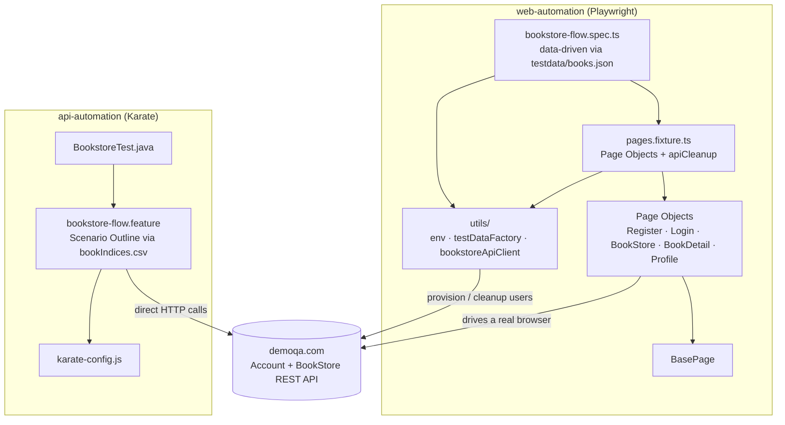
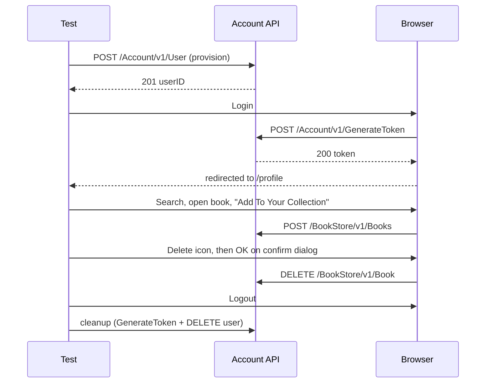

# Bookstore QA Automation — Xenith Senior QA Assessment (Task B)

Automates one flow on the [demoqa.com](https://demoqa.com) Book Store app: **register & login → search & add book → view collection → delete book → logout**.

| Suite | Tool | Style |
|---|---|---|
| `web-automation/` | Playwright + TypeScript | Page Object Model, data-driven |
| `api-automation/` | Karate | Scenario Outline, data-driven |

## Architecture



## Flow

Registration is provisioned via API rather than the UI — see [Notable findings](#notable-findings).



Karate exercises the same five steps at the API layer, including the register call.

## Setup

Prerequisites: **Node.js 20+**, **Java 17+**, **Maven 3.9+**.

```bash
# Web
cd web-automation
npm install && npx playwright install chromium
npm test                 # headless, Chromium
npm run test:headed      # watch it run
npm run report           # last HTML report

# API
cd api-automation
mvn test                 # report: target/karate-reports/karate-summary.html
```

Both suites create disposable test users and delete them on teardown — no manual setup, no shared state between runs.

### Cross-browser & device coverage

`playwright.config.ts` also defines **Firefox**, **WebKit**, and mobile emulation (**Pixel 5**, **iPhone 13**) as opt-in projects — verified working with the same Page Objects, no locator changes needed. `npm test` stays on Chromium by default for fast feedback; run the full matrix or a single project with:

```bash
npm run test:cross-browser        # all 5 projects
npx playwright test --project=firefox
npx playwright test --project=mobile-safari
```

## Data-driven design

- `web-automation/testdata/books.json` — one row per scenario, consumed by a loop in `bookstore-flow.spec.ts`.
- `api-automation/.../bookIndices.csv` — one row per scenario, consumed by a Karate `Scenario Outline`.
- Neither hard-codes an ISBN; both resolve it live from `GET /BookStore/v1/Books`.

## Security

- No secrets committed: `.env` is git-ignored, `.env.example` holds placeholders only; `.gitignore` also excludes `node_modules/`, `target/`, and build/report output.
- Every run generates a disposable `qa_user_*` / `karate_user_*` account and deletes it afterwards (Playwright's `apiCleanup` fixture runs even on failure; Karate deletes its user as the final step).
- CI (`.github/workflows/qa-automation.yml`) runs both suites the same way, with `BASE_URL` as a variable, not a hard-coded value.

## Notable findings

Surfaced by running the suites against the live app, not by reading a tutorial:

| Finding | Fix |
|---|---|
| `/register` is gated by an invisible reCAPTCHA v3 that never resolves under automated Chromium — verified with headed/headless runs, forced clicks, and ad-blocking; zero `POST /Account/v1/User` calls ever fire, while the identical Login form works instantly. | Provision users via the Account API (`bookstoreApiClient.registerUser`); drive login → logout through the real UI. `RegisterPage.ts` is kept for completeness but isn't on the critical path. Karate still registers via the API. |
| "Add To Your Collection" and "Back To Book Store" share the same `id="addNewRecordButton"`; the Logout button reuses `id="submit"` from unrelated forms. | Target by accessible role + name instead of id. |
| Clicking a collection row's delete icon only opens a "Delete Book" dialog — it doesn't call the API. The dialog's OK button (`#closeSmallModal-ok`) fires the actual `DELETE`. | `ProfilePage.deleteBookByIsbn()` clicks both. |
| The current build has no "repeat password" field on `/register` (unlike older demoqa write-ups). | Form model updated to match: First Name / Last Name / UserName / Password. |
